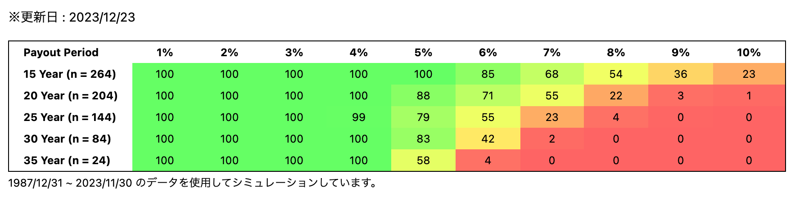

# Trinity Study 2024 Branch

MSCI ACWI を日本円建てで取崩しシミュレーションした日本版トリニティスタディ。
毎月最新データを自動的に取得し、シミュレーション結果を更新する。



[シミュレーション結果はこちら](https://trinity-study.kanaru.jp)

## トリニティスタディとは？

1998 年、[THE AAII JOURNAL](https://www.aaii.com/journal) に掲載された以下の論文の通称。

[Retirement Savings: Choosing a Withdrawal Rate That Is Sustainable](https://www.aaii.com/files/pdf/6794_retirement-savings-choosing-a-withdrawal-rate-that-is-sustainable.pdf)

現役時に貯めた資産を取り崩して生活する退職者を想定し、株式および債権で運用された資産の安全な取崩し率を調べている。

この論文では株式に S&P500(アメリカの株式インデックス)、債権にアメリカの長期高格付け社債を使用してシミュレーションしている。

本サイトでは、日本人向けとして ACWI(全世界株式インデックス)を日本円建てで取崩すシミュレーションをした。

## シミュレーションアルゴリズム

以下の手順でシミュレーション

1. 初年度の資産額を100に設定。毎年の取り崩し額は取り崩し率の数値（5%取り崩しの場合5）となる。
2. 初年度はそのまま取り崩し(100 – 5で資産残高95)
3. 2年目以降は資産残高に騰落率をかけて時価を計算し、そこから取り崩す。（10%値上がりした場合、95\*1.1–5=99.5）
4. 3を取り崩し年数分繰り返し、資産残高が0にならなければ成功とする。

### 試行回数について

上の操作をデータ数が許す限り繰り返す。

例えば、1987年12月から2023年11月のデータを取得出来ている場合、15年の取り崩し年数でシミュレーションする回数は以下のようになる。

- 1回目、1987年12月から2001年12月。
- 2回目、1988年1月から2002年1月。
- 3回目、1988年2月から2002年2月。
- ...
- 263回目、2009年10月から2023年10月。
- 264回目、2009年11月から2023年11月。

計算式にすると、`(データ月数) - 12 * (取り崩し年数 - 1)`となる。
取崩し期間が短いほど試行回数が多くなる。

### 実際のソースコード

[makeSimulationData.ts](./src/lib/server/makeSimulationData.ts)に記載。

```ts
type AcwiData = {
  date: Date;
  price_usd: number;
  price_jpy: number;
  jpy_usd: number;
};

const simulate = (
  acwiData: AcwiData[],
  payoutPeriod: number,
  numOfSimulation: number,
  withdrawalRate: number,
) => {
  let countFailure = 0; // 失敗回数
  for (let i = 0; i < numOfSimulation; i++) {
    // 資産残高。100にすると毎年の取り崩し額 = withdrawalRateになる
    let amountRemaining = 100;

    // 初年度の取り崩し
    amountRemaining -= withdrawalRate;

    for (let pi = 1; pi < payoutPeriod; pi++) {
      const prePrice = acwiData[i + 12 * (pi - 1)].price_jpy; // 1年前の基準価格
      const price = acwiData[i + 12 * pi].price_jpy; // 当月の基準価格
      const PercentageChange = price / prePrice; // 騰落率

      // 資産残高に騰落率を掛ける
      amountRemaining *= PercentageChange;

      // 資産残高から取崩し額を引く
      amountRemaining -= withdrawalRate;

      // 資産残高が0未満になったら失敗
      if (amountRemaining < 0) {
        countFailure++;
        break;
      }
    }
  }

  return (numOfSimulation - countFailure) / numOfSimulation;
};
```

## データ入手元

ACWI のチャートデータ : [End of day index data search](https://www.msci.com/end-of-day-data-search)

ドル円為替データ : [exchangerates API](https://exchangeratesapi.io/)
